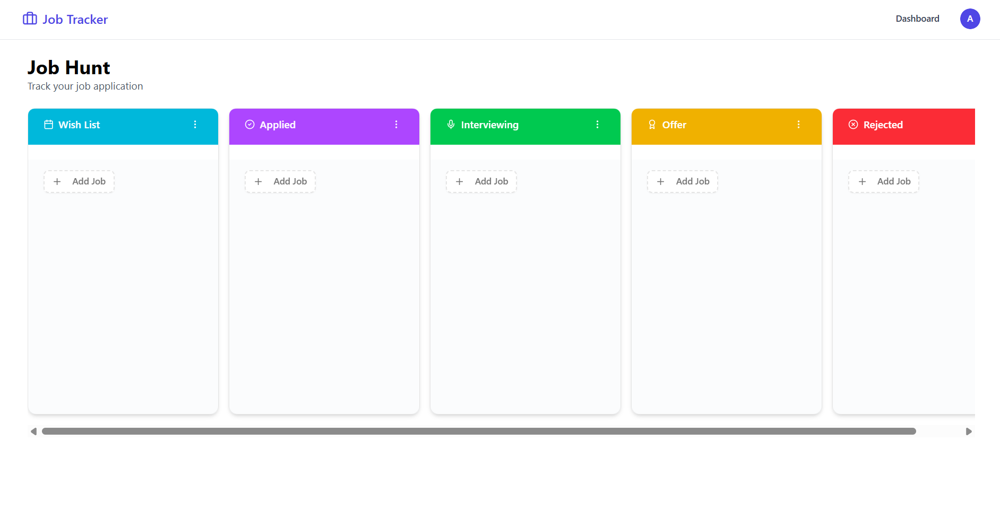

# 💼 Job Application Tracker

A modern full-stack job application tracking platform that helps users organize and manage their job search with an intuitive Kanban board interface.

🌐 **Live Demo:** https://job-application-tracker-xi-nine.vercel.app/

---

## 📌 Features

- 🔐 Secure Authentication using Better Auth
- 📋 Personal Kanban board for every user
- ➕ Create, update, and delete job applications
- 🔄 Drag & drop applications between stages
- 📊 Track application progress visually
- 🎯 Automatically creates a default board after signup
- 📱 Responsive design for desktop and mobile
- ⚡ Fast server-side rendering with Next.js App Router

---

## 🛠 Tech Stack

### Frontend
- Next.js 16
- React 19
- TypeScript
- Tailwind CSS 4
- Radix UI
- Lucide React

### Backend
- Next.js Server Actions
- Better Auth
- MongoDB
- Mongoose

### Other Libraries
- dnd-kit (Drag & Drop)
- Tailwind Merge
- Class Variance Authority

---

## 📷 Screenshots

### Dashboard



---

## 🚀 Getting Started

### Clone the repository

```bash
git clone https://github.com/KhaderSheriff/job-application-tracker.git
cd job-application-tracker
```

### Install dependencies

```bash
npm install
```

### Create Environment Variables

Create a `.env.local` file in the root directory.

```env
MONGODB_URI=your_mongodb_connection_string

BETTER_AUTH_SECRET=your_secret

BETTER_AUTH_URL=http://localhost:3000

NEXT_PUBLIC_BETTER_AUTH_URL=http://localhost:3000
```

### Start Development Server

```bash
npm run dev
```

Open

```
http://localhost:3000
```

---

## 📂 Project Structure

```
app/
│
├── api/
├── dashboard/
├── sign-in/
├── sign-up/

components/
│
├── ui/
├── kanban-board.tsx
├── job-card.tsx

lib/
│
├── actions/
├── auth/
├── hooks/
├── models/
├── db.ts
├── init-user-board.ts

scripts/
│
└── seed.ts
```

---

## 🎯 Application Workflow

1. User signs up
2. Better Auth creates a secure account
3. A personal **Job Hunt** board is automatically generated
4. Default columns are created:

- Wishlist
- Applied
- Interview
- Offer
- Rejected

5. Users can

- Add new job applications
- Edit job details
- Delete jobs
- Drag jobs between columns
- Track their progress visually

---

## ✨ Key Features Implemented

- Email & Password Authentication
- Automatic board creation
- Server Actions
- MongoDB Relationships
- Drag-and-Drop Kanban Board
- Protected Dashboard
- Responsive UI
- Loading & Error States

---

## 🔮 Future Improvements

- Search and filter jobs
- Resume upload
- Company notes
- Application reminders
- Calendar integration
- Email notifications
- Analytics dashboard
- Multiple boards
- Dark mode

---

## 📦 Available Scripts

```bash
npm run dev
```

Start development server.

```bash
npm run build
```

Build production application.

```bash
npm run start
```

Start production server.

```bash
npm run lint
```

Run ESLint.

```bash
npm run seed:jobs
```

Seed sample job applications.

---

## 👨‍💻 Author

**Khader Sheriff I**

- GitHub: https://github.com/KhaderSheriff
- LinkedIn: https://www.linkedin.com/in/khadersheriff

---

## ⭐ Support

If you found this project useful, consider giving it a ⭐ on GitHub.
